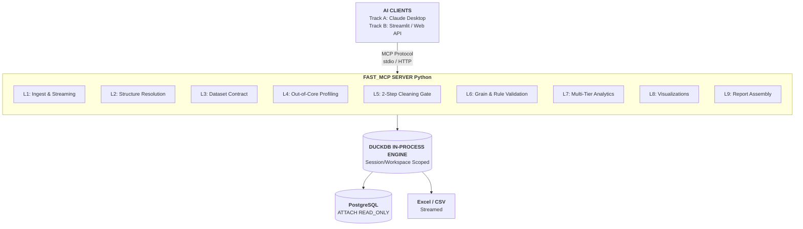

# Automated Analytics Agent (MCP Server)

An autonomous, human-in-the-loop analytics engine built on the **Model Context Protocol (MCP)**, **DuckDB**, and **PostgreSQL**. Designed for Apple Silicon (`arm64`), this agent connects AI clients (Claude Desktop, Streamlit) to structured databases and complex spreadsheets without silent data corruption, memory exhaustion, or hallucinated mutations.

Unlike standard "chat with your CSV" wrappers, this system enforces a **strict two-step human approval gate**, a **declared data contract (grain & keys)**, **isolated workspace catalogs**, and an **append-only cleaning ledger**.

## Architectural Overview



## Run it

```bash
uv sync --all-groups
ANALYTICS_UI_BACKEND=real uv run --group ui streamlit run ui/app.py   # the web app, on the engine
uv run pytest -q                                                      # the engine's suite
uv run python scripts/stress_matrix.py --round all                    # 95 files built to break it
```

The web app runs Upload & read → Clean → Contract → Explore / Ask → Files. Nothing loads, changes
or gets computed without a person's approval at each gate. The walkthrough, with what to say at
each screen, is in [`docs/DEMO.md`](docs/DEMO.md); screenshots are in `docs/demo/screens/`.
